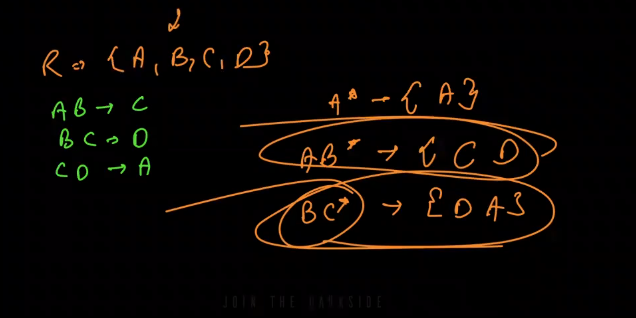

# Database Normalization - Complete Notes

## Table of Contents
1. [Database Schema](#database-schema)
2. [Functional Dependency](#functional-dependency)
3. [Armstrong's Axioms](#armstrongs-axioms)
4. [Database Keys](#database-keys)
5. [Attribute Closure](#attribute-closure)
6. [Normalization Forms](#normalization-forms)

---

## Database Schema

**Definition:** A database schema is the blueprint of the actual database that we will create. It defines:
- How we will store data
- Structure of tables
- Relationships between tables
- Constraints and rules

**Example:**
```
STUDENT Schema:
- student_id (Primary Key)
- name
- email
- department_id (Foreign Key)
```

---

## Functional Dependency

### What is Functional Dependency?

**Definition:** Functional Dependency defines the relationship between two attributes in a table.

**Notation:** `X → Y` (Read as: "X determines Y" or "Y is functionally dependent on X")

Where:
- **X** is the **Determinant** (left side)
- **Y** is the **Dependent** (right side)

### Meaning
"Y depends on X" means that for every unique value of X, we can uniquely identify the value of Y.

### Examples

#### Example 1: Simple Functional Dependency
```
EMPLOYEE Table:
employee_id → employee_name

If employee_id = 101, then employee_name = "John"
If employee_id = 102, then employee_name = "Sarah"

Each employee_id uniquely determines one employee_name.
```

#### Example 2: Multiple Dependencies
```
STUDENT Table:
student_id → name
student_id → email
student_id → department

All these attributes are functionally dependent on student_id
```

#### Example 3: Real-Life Example
```
BOOK Table:
ISBN → {title, author, publisher, price}

One ISBN number uniquely identifies:
- The book title
- The author
- The publisher
- The price
```

---

## Armstrong's Axioms

Armstrong's Axioms are a set of inference rules used to derive all functional dependencies in a relation.

### 1. Reflexivity Rule

**Definition:** If Y is a subset of X, then X → Y

**Example:**
```
address = {state, city, house_no, zip_code}

Then:
address → state          ✓ (state is subset of address)
address → city           ✓ (city is subset of address)  
address → house_no       ✓ (house_no is subset of address)
address → zip_code       ✓ (zip_code is subset of address)

{state, city} → state    ✓ (reflexive)
{state, city} → city     ✓ (reflexive)
```

### 2. Augmentation Rule (Partial Dependency)

**Definition:** If X → Y, then XZ → YZ for any attribute Z

**Example:**
```
Given: student_id → name

Then we can derive:
{student_id, age} → {name, age}
{student_id, department} → {name, department}
{student_id, email} → {name, email}

This creates partial dependencies (which we want to avoid in higher normal forms)
```

### 3. Transitivity Rule

**Definition:** If X → Y and Y → Z, then X → Z

**Example:**
```
Given:
student_id → department_id
department_id → department_name

Then:
student_id → department_name  ✓ (by transitivity)

Real Example:
employee_id → zip_code
zip_code → city

Therefore:
employee_id → city  ✓
```

---

## Database Keys

Keys are a set of attributes that help us uniquely identify a record in different situations.

### 1. Super Key

**Definition:** A set of one or more attributes that can uniquely identify a record in a table.

**Example:**
```
EMPLOYEE Table:
{e_id, e_name, e_phone, e_email, e_department}

Super Keys:
✓ {e_id}
✓ {e_phone}
✓ {e_email}
✓ {e_id, e_name}
✓ {e_id, e_phone}
✓ {e_phone, e_name}
✓ {e_id, e_name, e_phone}
✓ {e_id, e_name, e_phone, e_email}
... and many more combinations
```

**Note:** Any combination containing a unique attribute forms a super key.

### 2. Candidate Key

**Definition:** A **minimal** super key - the minimum set of attributes that can uniquely identify a record. No subset of a candidate key can be a super key.

**Example:**
```
EMPLOYEE Table:
{e_id, e_name, e_phone, e_email, e_department}

Candidate Keys:
✓ {e_id}          - Minimal (cannot remove any attribute)
✓ {e_phone}       - Minimal (unique phone number)
✓ {e_email}       - Minimal (unique email)

NOT Candidate Keys:
✗ {e_id, e_name}  - Not minimal (e_name is redundant)
✗ {e_phone, e_id} - Not minimal (both can individually identify)
```

**Real-World Example:**
```
STUDENT Table:
- student_id
- roll_number  
- email
- name
- age

Candidate Keys:
1. {student_id}    - University-assigned ID
2. {roll_number}   - Class roll number
3. {email}         - Unique email address
```

### 3. Composite Key

**Definition:** A key consisting of 2 or more attributes that **together** uniquely identify a record. The individual attributes cannot uniquely identify records on their own.

**Example:**
```
ENROLLMENT Table:
{student_id, course_id, semester, grade}

Composite Key: {student_id, course_id, semester}

Explanation:
- student_id alone ✗ (one student can enroll in multiple courses)
- course_id alone ✗ (one course can have multiple students)
- semester alone ✗ (many enrollments per semester)
- {student_id, course_id, semester} ✓ (unique combination)

Example Records:
student_id | course_id | semester | grade
-----------|-----------|----------|------
101        | CS101     | Fall2023 | A
101        | CS102     | Fall2023 | B     ← Same student, different course
102        | CS101     | Fall2023 | A     ← Different student, same course
101        | CS101     | Spring2024| A+    ← Same student & course, different semester
```

### 4. Primary Key

**Definition:** One candidate key chosen to be the main identifier for the table. It must be:
- **Unique** - No duplicate values
- **Non-null** - Cannot contain NULL values
- **Stable** - Shouldn't change over time

**Example:**
```
EMPLOYEE Table:

Candidate Keys:
- e_id
- e_phone  
- e_email

Chosen Primary Key: e_id

Why?
✓ Never changes
✓ Always present (non-null)
✓ Simple single column
✓ No business meaning (won't need updates)

Why NOT e_phone or e_email?
✗ People change phone numbers
✗ People change email addresses
```

### 5. Foreign Key

**Definition:** An attribute (or set of attributes) that refers to the primary key in another table. It creates relationships between tables.

**Example:**
```
DEPARTMENT Table:
dept_id (PK) | dept_name     | location
-------------|---------------|----------
1            | Computer Sci  | Building A
2            | Mathematics   | Building B

EMPLOYEE Table:
e_id (PK) | e_name  | dept_id (FK) | salary
----------|---------|--------------|--------
101       | John    | 1            | 50000
102       | Sarah   | 1            | 55000
103       | Mike    | 2            | 48000

Here:
- dept_id in EMPLOYEE table is a Foreign Key
- It references dept_id (Primary Key) in DEPARTMENT table
- Links employees to their departments
```

---

## Attribute Closure

### What is Attribute Closure?

**Definition:** The attribute closure of a set of attributes X (denoted as X⁺) is the set of all attributes that can be functionally determined by X using the given functional dependencies.

### How to Find Attribute Closure

**Algorithm:**
1. Start with the given set of attributes
2. Apply all functional dependencies
3. Add all attributes that can be determined
4. Repeat until no new attributes can be added

### Example 1: Basic Attribute Closure


**Given:**
```
R = {A, B, C, D, E}

Functional Dependencies:
A → B
A → E
C → B
C → E
B → D
```

**Find: A⁺ (Attribute closure of A)**

**Solution:**
```
Step 1: Start with A⁺ = {A}

Step 2: Apply FD "A → B"
        A⁺ = {A, B}

Step 3: Apply FD "A → E"  
        A⁺ = {A, B, E}

Step 4: Apply FD "B → D" (since B is in A⁺)
        A⁺ = {A, B, E, D}

Step 5: Check remaining FDs
        - C → B: Cannot apply (C not in A⁺)
        - C → E: Cannot apply (C not in A⁺)

Final Answer: A⁺ = {A, B, E, D}
```

**Finding Candidate Keys from the example:**
```
Given: R = {A, B, C, D, E}

To find candidate keys, we need to find minimal sets that give us all attributes.

Test different combinations:

1. A⁺ = {A, B, E, D} - Missing C ✗
2. B⁺ = {B, D} - Missing A, C, E ✗
3. C⁺ = {C, B, E, D} - Missing A ✗
4. {A, C}⁺ = ?

Finding {A, C}⁺:
Step 1: {A, C}⁺ = {A, C}
Step 2: Apply A → B: {A, C, B}
Step 3: Apply A → E: {A, C, B, E}
Step 4: Apply C → B: Already have B
Step 5: Apply C → E: Already have E
Step 6: Apply B → D: {A, C, B, E, D}

{A, C}⁺ = {A, B, C, D, E} ✓ Contains all attributes!

Answer: {A, C} is a Candidate Key
```

### Example 2: Attribute Closure with Multiple Steps




**Given:**
```
R = {A, B, C, D}

Functional Dependencies:
AB → C
BC → D
CD → A
```

**Q1. Find: {AB}⁺**

**Solution:**
```
Step 1: {AB}⁺ = {A, B}

Step 2: Apply FD "AB → C"
        {AB}⁺ = {A, B, C}

Step 3: Apply FD "BC → D" (since we have both B and C)
        {AB}⁺ = {A, B, C, D}

Step 4: Check FD "CD → A" (already have A)
        No new attributes

Final Answer: {AB}⁺ = {A, B, C, D}

Since {AB}⁺ contains all attributes, {AB} is a Candidate Key!
```

**Q2. Find: {BC}⁺**

**Solution:**
```
Step 1: {BC}⁺ = {B, C}

Step 2: Apply FD "BC → D"
        {BC}⁺ = {B, C, D}

Step 3: Apply FD "CD → A" (since we have both C and D)
        {BC}⁺ = {B, C, D, A}

Step 4: Check FD "AB → C" (already have C)
        No new attributes

Final Answer: {BC}⁺ = {A, B, C, D}

Since {BC}⁺ contains all attributes, {BC} is also a Candidate Key!
```

**Summary of Candidate Keys:**
```
For R = {A, B, C, D} with given FDs:

Candidate Keys found:
1. {AB}⁺ → {A, B, C, D} ✓
2. {BC}⁺ → {C, D, A, B} ✓
```

---

## Functional Dependency Closure

**Definition:** Functional Dependency Closure (F⁺) contains all functional dependencies that can be derived from a given set of FDs using Armstrong's Axioms.

### Example

**Given:**
```
F = {A → B, C → D, B → C}
```

**Find F⁺ (FD Closure):**

```
Original FDs:
1. A → B
2. C → D
3. B → C

Derived FDs (using Armstrong's Axioms):

By Reflexivity:
4. A → A
5. B → B
6. C → C
7. D → D

By Transitivity:
8. A → C  (from A → B and B → C)
9. A → D  (from A → C and C → D)
10. B → D (from B → C and C → D)

By Augmentation:
11. AB → B
12. AC → BC
13. BC → CD
... and many more

F⁺ = {A → A, A → B, A → C, A → D, B → B, B → C, B → D, C → C, C → D, D → D, ...}
```

---

## Normalization Forms

### Why Normalize?

Normalization eliminates:
- **Data Redundancy** - Duplicate data
- **Update Anomalies** - Inconsistent updates
- **Insert Anomalies** - Cannot insert data without other data
- **Delete Anomalies** - Losing data unintentionally

### 1st Normal Form (1NF)

**Rules:**
1. Each column must contain atomic (indivisible) values
2. Each column must contain values of a single type
3. Each row must be unique

**Example - NOT in 1NF:**
```
STUDENT Table:
student_id | name  | phone_numbers
-----------|-------|------------------
101        | John  | 123-456, 789-012  ✗ (Multiple values)
102        | Sarah | 555-1234
```

**Converted to 1NF:**
```
STUDENT Table:
student_id | name  | phone_number
-----------|-------|-------------
101        | John  | 123-456
101        | John  | 789-012      ✓ (Atomic values)
102        | Sarah | 555-1234
```

### 2nd Normal Form (2NF)

**Rules:**
1. Must be in 1NF
2. No partial dependencies (all non-key attributes must depend on the entire primary key)

**Example - NOT in 2NF:**
```
ENROLLMENT Table (Composite PK: {student_id, course_id}):
student_id | course_id | student_name | course_name | grade
-----------|-----------|--------------|-------------|-------
101        | CS101     | John         | Database    | A
101        | CS102     | John         | Algorithm   | B

Partial Dependencies:
- student_id → student_name  ✗ (depends on part of PK)
- course_id → course_name    ✗ (depends on part of PK)
```

**Converted to 2NF:**
```
STUDENT Table:
student_id | student_name
-----------|-------------
101        | John
102        | Sarah

COURSE Table:
course_id | course_name
----------|------------
CS101     | Database
CS102     | Algorithm

ENROLLMENT Table:
student_id | course_id | grade
-----------|-----------|------
101        | CS101     | A     ✓ (No partial dependencies)
101        | CS102     | B
```

### 3rd Normal Form (3NF)

**Rules:**
1. Must be in 2NF
2. No transitive dependencies (non-key attributes must not depend on other non-key attributes)

**Example - NOT in 3NF:**
```
EMPLOYEE Table (PK: employee_id):
employee_id | name  | zip_code | city
------------|-------|----------|--------
101         | John  | 12345    | NYC
102         | Sarah | 67890    | LA

Transitive Dependency:
- employee_id → zip_code
- zip_code → city
- Therefore: employee_id → city  ✗ (transitive)
```

**Converted to 3NF:**
```
EMPLOYEE Table:
employee_id | name  | zip_code
------------|-------|----------
101         | John  | 12345
102         | Sarah | 67890    ✓

ZIP_CODE Table:
zip_code | city
---------|------
12345    | NYC
67890    | LA   ✓ (No transitive dependencies)
```

### Boyce-Codd Normal Form (BCNF)

**Rules:**
1. Must be in 3NF
2. For every functional dependency X → Y, X must be a super key

**Example - In 3NF but NOT in BCNF:**
```
TEACHING Table:
student_id | subject   | teacher
-----------|-----------|----------
101        | Database  | Prof. A
101        | Algorithm | Prof. B
102        | Database  | Prof. A

FDs:
- {student_id, subject} → teacher
- teacher → subject  ✗ (teacher is not a super key)
```

**Converted to BCNF:**
```
STUDENT_TEACHER Table:
student_id | teacher
-----------|----------
101        | Prof. A
101        | Prof. B
102        | Prof. A

TEACHER_SUBJECT Table:
teacher  | subject
---------|----------
Prof. A  | Database
Prof. B  | Algorithm  ✓ (All determinants are super keys)
```

---

## Quick Reference Guide

### Key Points to Remember

1. **Functional Dependency:** X → Y means X determines Y
2. **Candidate Key:** Minimal set that determines all attributes
3. **Attribute Closure X⁺:** All attributes determined by X
4. **1NF:** Atomic values only
5. **2NF:** No partial dependencies
6. **3NF:** No transitive dependencies  
7. **BCNF:** Every determinant must be a super key

### Finding Candidate Keys - Steps

```
1. Find all attributes that never appear on RHS of FDs
   → These MUST be in every candidate key

2. Find attribute closure of different combinations

3. Check if closure contains all attributes
   → If yes, it's a super key

4. Check if any subset is also a super key
   → If no subset is a super key, it's a candidate key
```

---

## Practice Problems

### Problem 1
```
Given: R = {A, B, C, D, E}
FDs: {A → B, B → C, C → D, D → E}

Find:
a) A⁺
b) Can didate keys
c) Highest normal form
```

### Problem 2
```
Given: R = {A, B, C, D}
FDs: {AB → C, C → D, D → A}

Find:
a) {AB}⁺
b) {C}⁺
c) All candidate keys
```

---

**End of Notes**

*Remember: Normalization is about organizing data to reduce redundancy and improve data integrity!*


